Lab 02 - Plastic waste
================
Ben Hardin
1/17/2023

## Load packages and data

``` r
library(tidyverse) 
```

``` r
plastic_waste <- read.csv("data/plastic-waste.csv")
```

## Exercises

### Exercise 1

This code chunk creates a set of histograms showing the distribution of
plastic waste per capita (PWPC) separated by country. The histograms
show that African countries typically have the least amount of PWPC, and
that most countries have a PWPC of \< 0.5 kg per person regardless of
continent. There is one country in North America with a very high PWPC,
which we know from the lab instructions is Trinidad and Tobago.

``` r
ggplot(data = plastic_waste,
       aes(x = plastic_waste_per_cap))+
  geom_histogram(binwidth = 0.2)+
  facet_wrap(~ continent)
```

    ## Warning: Removed 51 rows containing non-finite values (`stat_bin()`).

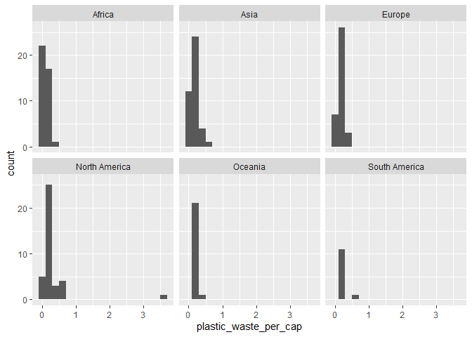<!-- -->

### Exercise 2.1

Here we have displayed the same information from the histograms in a
different way by plotting the density distribution of PWPC for each
continent, separated by color. However, the graph is hard to read
because the alpha level is too high (in this case, 1.0), so the
distributions cover one another up.

``` r
ggplot(data = plastic_waste,
       aes(x = plastic_waste_per_cap,
           color = continent,
           fill = continent))+
  geom_density()
```

    ## Warning: Removed 51 rows containing non-finite values (`stat_density()`).

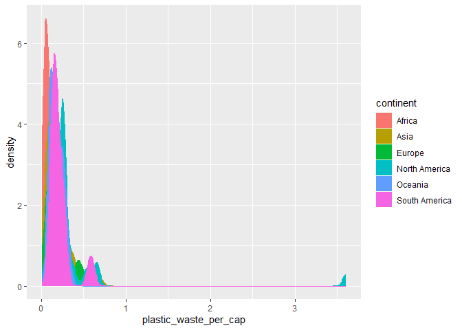<!-- -->

Now, if we adjust the alpha to 0.25, the distributions are transparent,
allowing us to see the full distribution of PWPC for each continent all
at once.

``` r
ggplot(data = plastic_waste,
       aes(x = plastic_waste_per_cap,
           color = continent,
           fill = continent))+
  geom_density(alpha = 0.25)
```

    ## Warning: Removed 51 rows containing non-finite values (`stat_density()`).

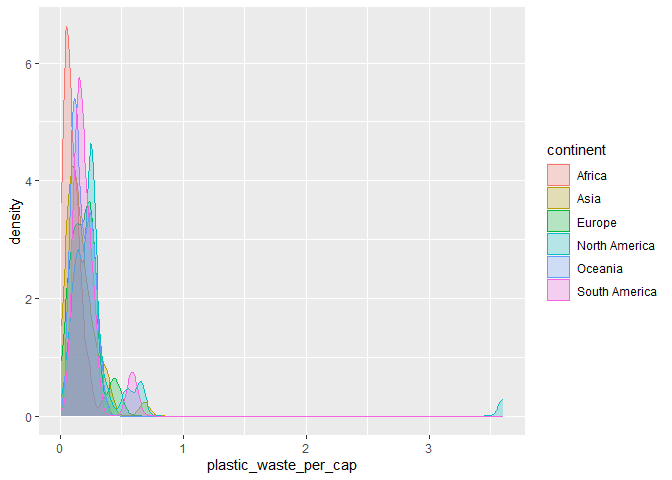<!-- -->

### Exercise 2.2

We mapped the color and fill of the curves to the aesthetics argument
because this argument is used to map certain characteristics of the plot
to the values or levels of a variable in the dataset. In this case, we
wanted each level (i.e., each continent) to be represented by a separate
distribution mapped to a unique color.

We instead mapped the alpha to the geom argument because this argument
is used to determine characteristics of all the points in the plot
regardless of their value or level. In this case, we wanted the
distributions to be equally transparent for all continents.

### Exercise 3.1

The plots below show the same information displayed in Exercises 1 & 2,
this time presented as a box plot and as a violin plot.

The box plot clearly shows the median PWPC score among countries in each
continent as well as the countries that have unusually high PWPC scores
(i.e., outliers) and how far those outliers are from the typical range
of scores.

Conversely, the violin plot does a nice job of showing how PWPC is
distributed in each continent. For example, the fact that the violins
are more bottom heavy for Africa and South America shows that these
continents have a greater proportion of countries with relatively low
PWPC than other continents with more peaks and valleys.

``` r
ggplot(data = plastic_waste,
       mapping = aes(x = continent, y = plastic_waste_per_cap))+
  geom_boxplot()
```

    ## Warning: Removed 51 rows containing non-finite values (`stat_boxplot()`).

<!-- -->

``` r
ggplot(data = plastic_waste,
       mapping = aes(x = continent, y = plastic_waste_per_cap))+
  geom_violin()
```

    ## Warning: Removed 51 rows containing non-finite values (`stat_ydensity()`).

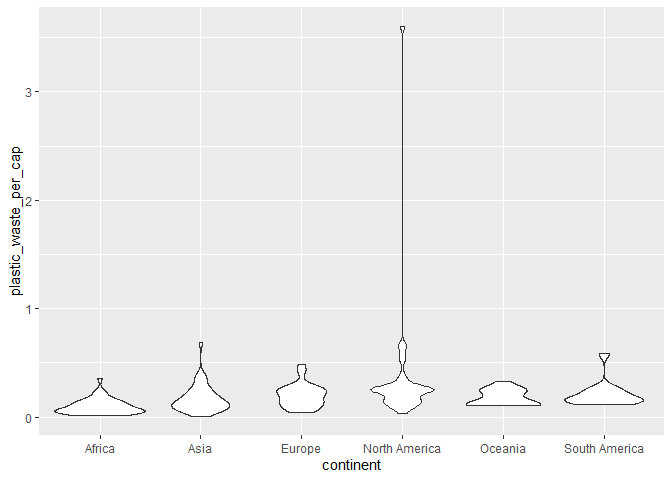<!-- -->

### Exercise 4.1

The scatterplot below shows the relationship between plastic waste per
capita (PWPC) and the amount of mismanaged plastic waste per capita. To
make the plot easier to interpret, I have filtered out Trinidad and
Tobago, which is an extreme outleir with a PWPC greater than 3. It looks
like there may be a few different relationships in this dataset, with a
subset of datapoints showing a positive linear relationship between PWPC
and mismanaged PWPC, while another subset shows no relationship because
the amount of mismanaged PWPC is consistently low regardless of the
amount of PWPC.

``` r
ggplot(data = plastic_waste %>%
         filter(plastic_waste_per_cap < 3), aes(x = mismanaged_plastic_waste_per_cap, 
                                 y = plastic_waste_per_cap))+
  geom_point()
```

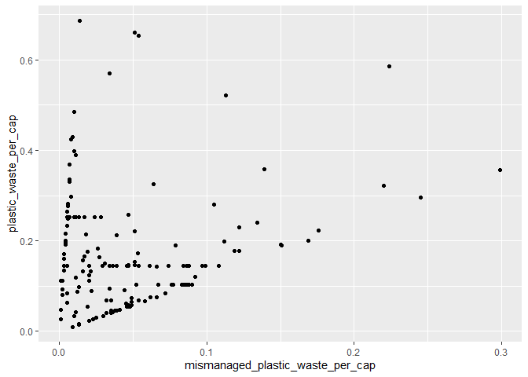<!-- -->

### Exercise 4.2

Now, we use color to show which continent each datapoint in the
scatterplot is from. Now we can see that the relationship between PWPC
and mismanaged PWPC seems to differ between different continents.

The relationship appears to be positive and linear for countries in
Africa and Oceana. This shows that for countries within these
continents, a greater amount of plastic waste is typically associated
with a greater amount of mismanaged plastic waste.

Conversely, there does not appear to be much of a linear relationship
for countries in Europe and South America. Within these continents, it
looks like countries typically have a low amount of mismanaged plastic
waste, regardless of their overall amount of plastic waste.

For countries within Asia and North America, PWPC and mismanaged PWPC
seem to show a relationship that is somewhere in between these two
patterns.

``` r
ggplot(data = plastic_waste %>%
         filter(plastic_waste_per_cap < 3), aes(x = mismanaged_plastic_waste_per_cap, 
                                 y = plastic_waste_per_cap,
                                 color = continent))+
  geom_point(size = 2)
```

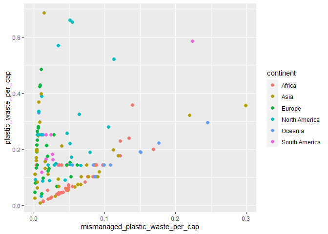<!-- -->

### Exercise 4.3

Below are two scatterplots showing the relationship between amount of
plastic waste and (a) total population, and (b) coastal population.
There doesn’t seem to be much of a linear association between either
population measure and amount of plastic waste, although there might be
slightly more of a linear relationship for coastal population than for
total population.

``` r
ggplot(data = plastic_waste %>%
         filter(plastic_waste_per_cap < 3), aes(x = total_pop, y = plastic_waste_per_cap))+
  geom_point()
```

    ## Warning: Removed 10 rows containing missing values (`geom_point()`).

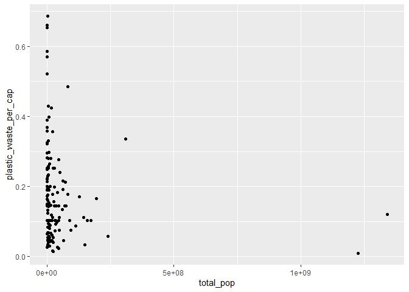<!-- -->

``` r
ggplot(data = plastic_waste %>%
         filter(plastic_waste_per_cap < 3), aes(x = coastal_pop, y = plastic_waste_per_cap))+
  geom_point()
```

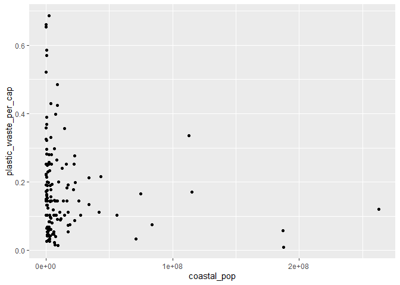<!-- -->

### Exercise 5.1

The code below recreates the scatterplot showing the relationship
between the amount of plastic waste and the proportion of a country’s
total population that is coastal.

Overall, there doesn’t seem to be much of a linear relationship between
coastal population proportion and amount of plastic waste, although it
looks like there may be a slight linear relationship for coastal
population proportions that are less than about 0.75.

``` r
ggplot(data = plastic_waste %>%
         filter(plastic_waste_per_cap < 3), aes(x = coastal_pop/total_pop, 
                                                y = plastic_waste_per_cap))+
  geom_point(aes(color = continent))+
  geom_smooth(color = "black")+
  scale_color_viridis_d()+
  labs(x = "Coastal population proportion (Coastal/total population)",
       y = "Plastic waste per capita",
       color = "Continent")
```

    ## `geom_smooth()` using method = 'loess' and formula = 'y ~ x'

    ## Warning: Removed 10 rows containing non-finite values (`stat_smooth()`).

    ## Warning: Removed 10 rows containing missing values (`geom_point()`).

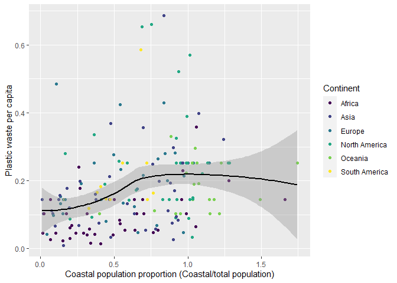<!-- -->

### Bonus for fun.

For fun, I wanted to try remaking some of the earlier visualizations of
the distribution of PWPC by continent using some more visually appealing
and informative plots.

These are basically the same as the density distributions from Ex. 2 and
the box plots from Ex. 3, except filtering out the extreme outlier
Trinidad and Tobago and recoloring the graphs to be a little easier to
read, more pleasant to look at, and hopefully more accessible.

``` r
ggplot(data = plastic_waste %>%
         filter(plastic_waste_per_cap < 3),
       aes(x = plastic_waste_per_cap,
           color = continent,
           fill = continent))+
  geom_density(alpha = 0.25, color = "black")+
  scale_fill_viridis_d()+
  labs(x = "Plastic waste per capita",
       y = "Density")
```

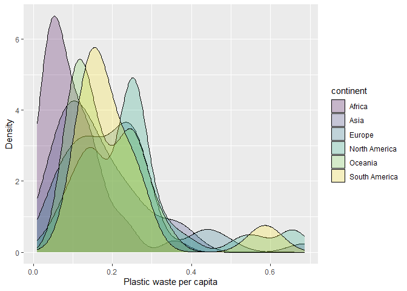<!-- -->

``` r
ggplot(data = plastic_waste %>%
         filter(plastic_waste_per_cap < 3),
       mapping = aes(x = continent, y = plastic_waste_per_cap,
                     fill = continent))+
  geom_violin(alpha = 0.7)+
  scale_fill_viridis_d()+
  labs(x = "Continent", y = "Plastic Waste Per Cap")
```

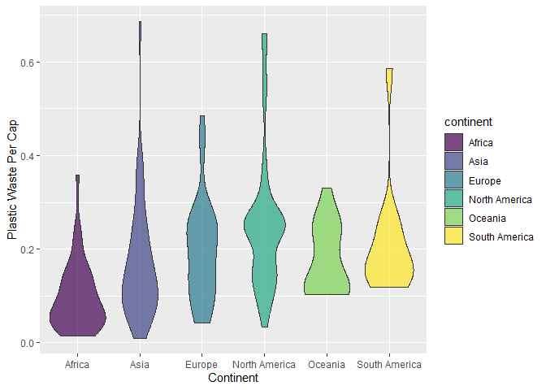<!-- -->

## Pro-Tips

### Excercise 3

Try this :D

ggplot(data = plastic_waste, mapping = aes(x = continent, y =
plastic_waste_per_cap)) + geom_violin()+ geom_boxplot(width=.3,
fill=“green”) + stat_summary(fun.y=median, geom=“point”)

### Exercise 5

Helpful
reference:<http://www.sthda.com/english/wiki/ggplot2-themes-and-background-colors-the-3-elements>
